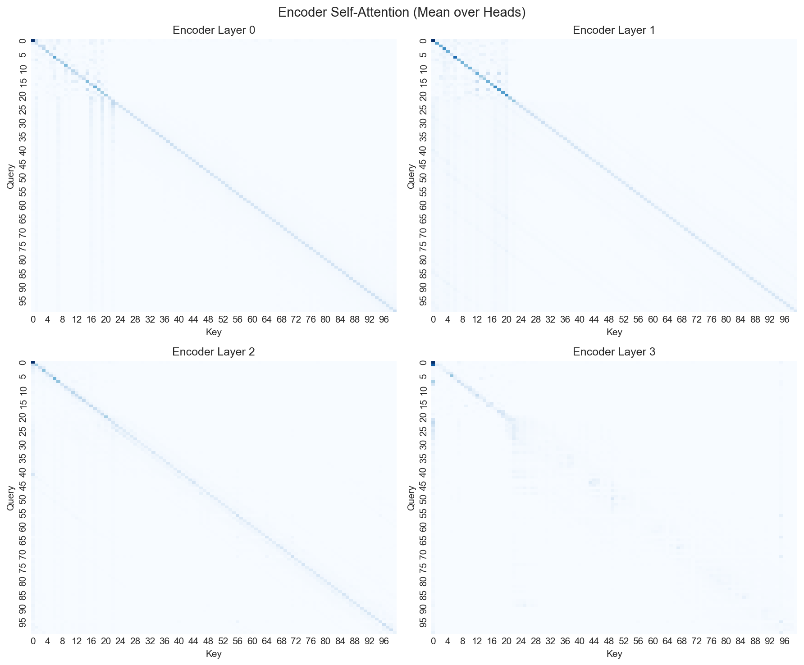
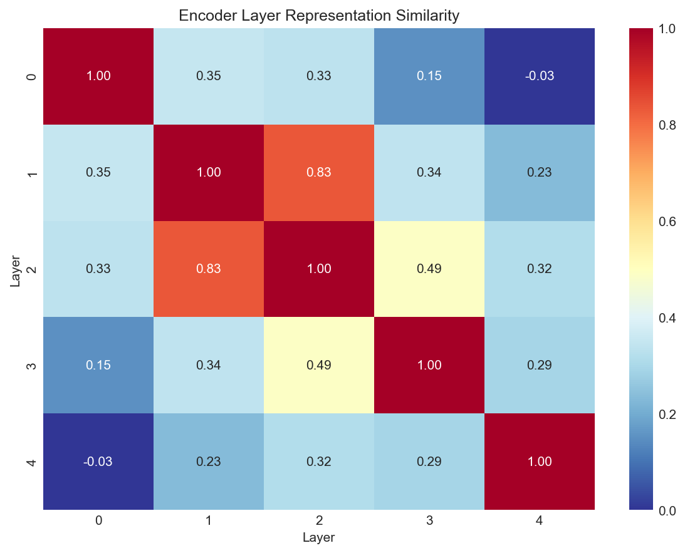
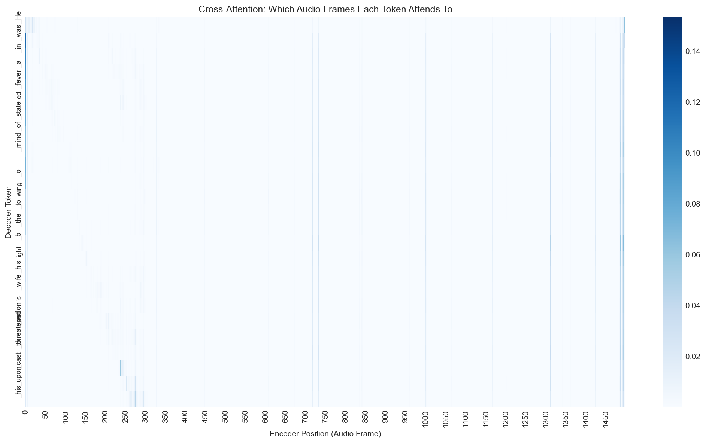
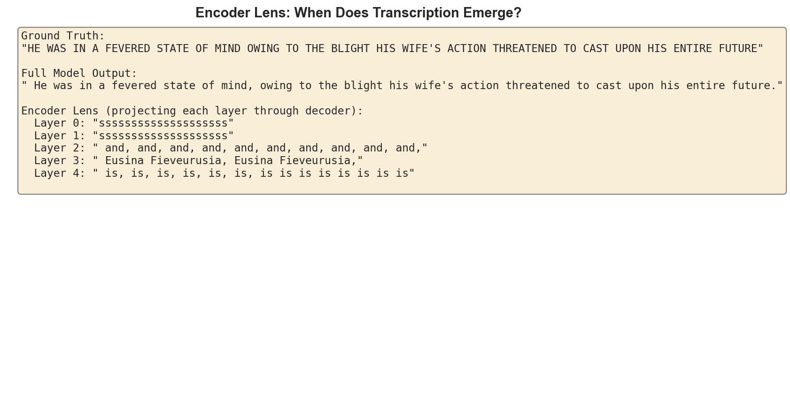
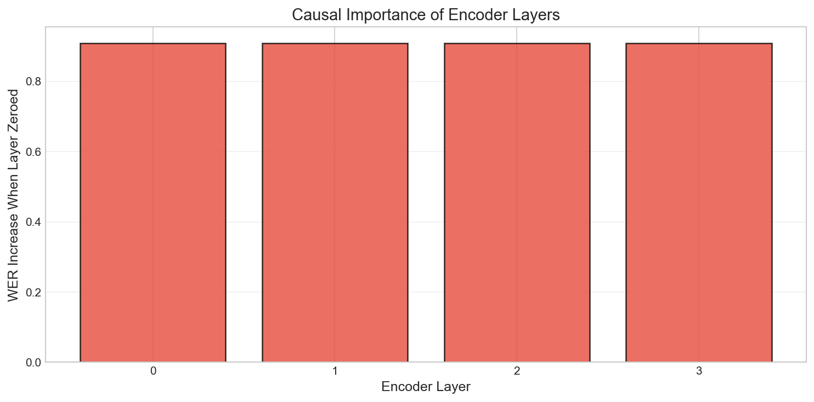

# Whisper SAE: Sparse Autoencoder Analysis for Whisper

Mechanistic interpretability for OpenAI's Whisper speech model using Sparse Autoencoders.

## Overview

Train SAEs on Whisper's internal activations to discover interpretable features in speech processing. Analyze both encoder (acoustic/phonetic) and decoder (linguistic/semantic) representations.

## Analysis Results

### Encoder Self-Attention Patterns

Each encoder layer shows predominantly **local attention** - audio frames attend to nearby frames. This makes sense for speech where neighboring frames are acoustically correlated.



### Layer Representation Similarity

Cosine similarity between encoder layer representations shows gradual transformation across layers.



### Cross-Attention: Audio to Text Alignment

Shows which audio frames the decoder attends to when generating each token. You can see the monotonic alignment typical of speech recognition.



### Encoder Lens: When Does Transcription Emerge?

Projecting each encoder layer through the decoder reveals when semantic content becomes available.



### Activation Patching: Causal Importance

Zeroing out each encoder layer and measuring WER change shows all layers are causally important.



## Quick Start

```bash
# Setup
uv sync

# Run tests
uv run pytest tests/ -v

# Analysis notebook
uv run jupyter notebook notebooks/logit_lens_and_attention.ipynb
```

## Architecture

- **TopK SAE**: Sparse autoencoder with TopK activation (more stable than L1 for speech)
- **8x expansion**: 384 -> 3072 features for whisper-tiny
- **Unit-norm decoder**: Normalized columns for training stability
- **Dead feature resampling**: Reinitialize unused features

## Project Structure

```
whisper_analysis/
├── src/whisper_sae/
│   ├── config.py           # Pydantic configuration
│   ├── sae/
│   │   ├── hooks.py        # Whisper activation extraction
│   │   ├── model.py        # TopKSAE, ReLUSAE
│   │   └── training.py     # Training loop with AMP
│   └── data/
│       ├── librispeech.py  # Dataset loading
│       └── feature_cache.py # Activation caching
├── tests/                   # 89 tests
├── notebooks/               # Analysis notebooks
├── configs/                 # YAML configs
└── docs/                    # Documentation
```

## Features

- **Activation Hooks**: Extract from any encoder/decoder layer with layer norm
- **CircuitsVis Integration**: Interactive attention visualization
- **Encoder Lens**: Project encoder layers through decoder to see when transcription emerges
- **Activation Patching**: Measure causal importance of layers

## Based On

- aiOla "Beyond Transcription" (2025) - Encoder lens technique
- Mozilla Builders (2024) - TopK SAEs for Whisper
- TransformerLens/SAELens conventions

## Requirements

- Python 3.11+
- PyTorch 2.1+
- MPS (Apple Silicon) or CUDA

## License

MIT
